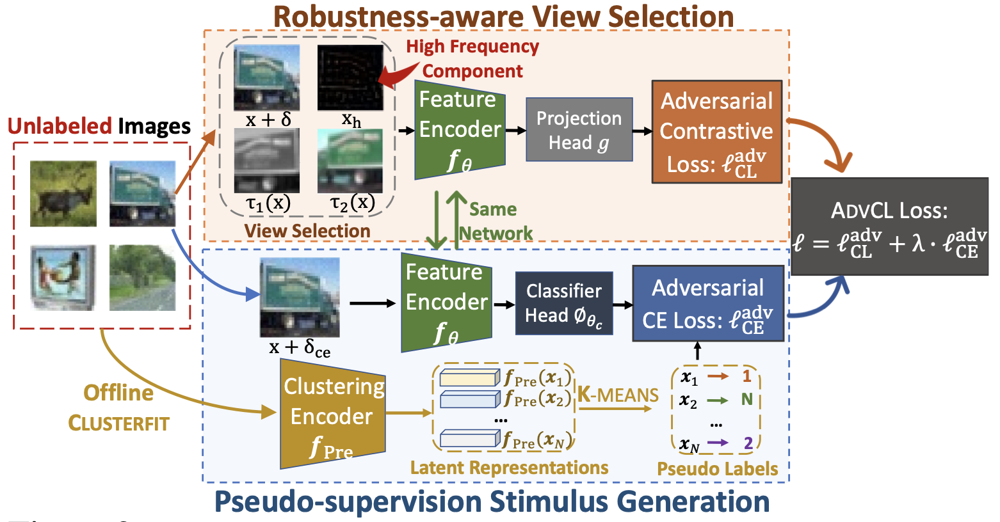

# AdvCL
# When Does Contrastive Learning Preserve Adversarial Robustness from Pretraining to Finetuning?

This repository contains the implementation code for paper: <br>
__When Does Contrastive Learning Preserve Adversarial Robustness from Pretraining to Finetuning?__ <br>
[Lijie Fan](http://lijiefan.me), [Sijia Liu](https://lsjxjtu.github.io), [Pin-Yu Chen](https://sites.google.com/site/pinyuchenpage), [Gaoyuan Zhang](https://researcher.watson.ibm.com/researcher/view.php?person=ibm-Gaoyuan.Zhang), and [Chuang Gan](http://people.csail.mit.edu/ganchuang/) <br>
_35th Conference on Neural Information Processing Systems (NeurIPS), 2021_ <br>
[[Website](http://lijiefan.me/project_webpage/AdvCL_Neurips/index.html)] [[arXiv](https://arxiv.org/abs/2111.01124)] [[Paper](https://arxiv.org/pdf/2111.01124.pdf)] 

If you find this code or idea useful, please consider citing our work:
```bib
@inproceedings{fan2021does,
  title={When Does Contrastive Learning Preserve Adversarial Robustness from Pretraining to Finetuning?},
  author={Lijie Fan, Sijia Liu, Pin-Yu Chen, Gaoyuan Zhang and Chuang Gan},
  booktitle={Conference on Neural Information Processing Systems (NeurIPS)},
  year={2021}
}
```

## Introduction
In this paper we revisit and advance CL principles through the lens of robustness enhancement. We show that (1) the design of contrastive views matters: High-frequency components of images are beneficial to improving model robustness; (2) Augmenting CL with pseudo-supervision stimulus (e.g., resorting to feature clustering) helps preserve robustness without forgetting. Equipped with our new designs, we propose AdvCL, a novel adversarial contrastive pretraining framework. We show that AdvCL is able to enhance cross-task robustness transferability without loss of model accuracy and finetuning efficiency.

## Method

The overall pipeline of AdvCL. It mainly has two ingredients: robustness-aware view selection (orange box) and pseudo-supervision stimulus generation (blue box). The view selection mechanism is advanced by high frequency components, and the supervision stimulus is created by generating pseudo labels for each image through ClusterFit. The pseudo label  (in yellow color) can be created in an offline manner and will not increase the computation overhead.
## Installation
### Prerequisites
Create `./data` and `./checkpoint` directories.
Download CIFAR dataset, and place them under `./data`.
All models will be stored in `./checkpoint`. 
### Environment requirements
- PyTorch >= 1.8
- CUDA
- NVIDIA Apex
- numpy 


## Pretraining 
Pretrain the model on CIFAR-10 with AdvCL
```bash
python pretraining_advCL.py --dataset cifar10 --batch-size 512 --learning_rate 0.5 -t 0.5 --cosine --weight_decay 1e-4
```

## Finetuning
Standard Linear Finetuning AdvCLd pretraining model on CIFAR-10 (Need to do AdvCL pretraining on CIFAR10 first)
```bash
python finetuning_advCL_SLF.py --ckpt checkpoint/advcl_cifar10/epoch_1000.ckpt
```

